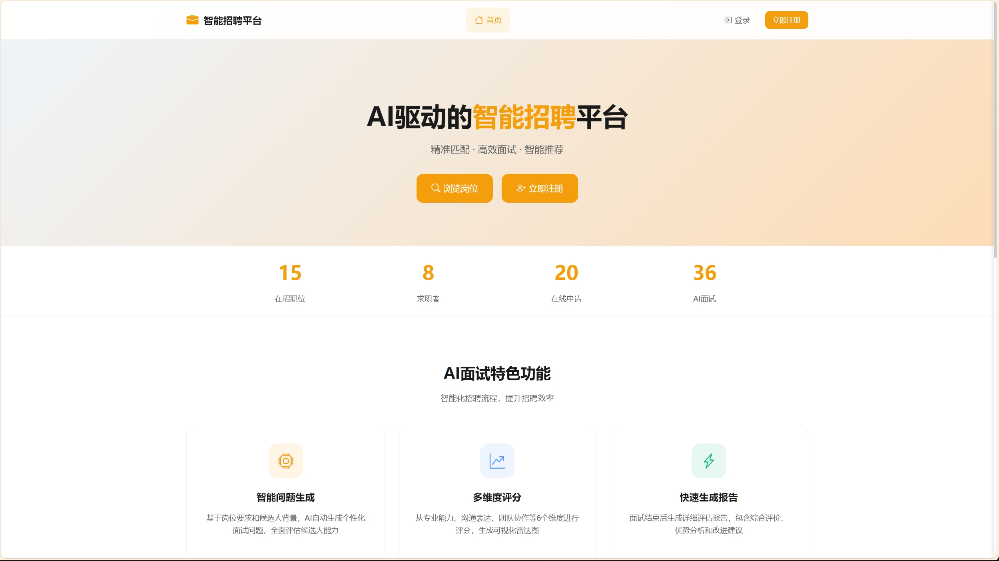
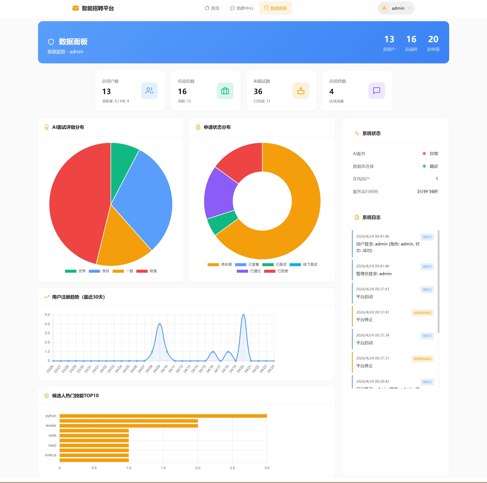
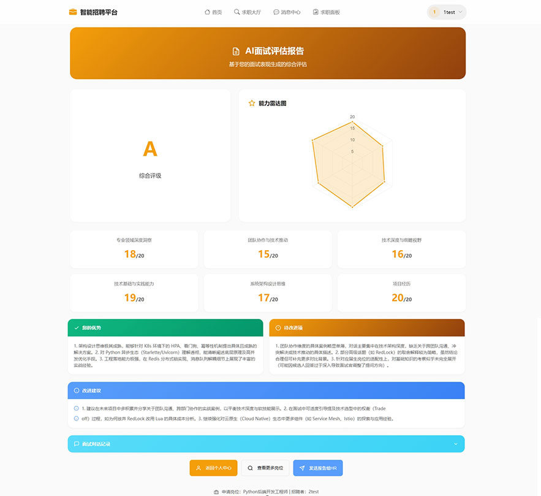

# 企轻聘 - 智能招聘平台 (Q-AI Interview System)


基于 AI 的智能招聘与面试系统，面向计算机行业的私聘招聘平台。支持流式 AI 对话模拟面试、六维雷达图评估报告、消息中心等功能。

## 项目简介

智能招聘平台是一个企业私聘解决方案，初始领域定位为计算机行业。通过修改提示词，可无缝切换至其他行业领域。

### 核心特性

- **流式 AI 面试**：基于 Ollama 的本地大模型，支持实时流式对话面试
- **六维雷达图报告**：从专业领域深度、团队协作、技术视野、实践能力、架构设计、项目真实性六个维度评估候选人
- **智能推荐系统**：基于关键词匹配和薪资匹配的岗位/候选人推荐
- **多角色支持**：支持候选人(Candidate)、HR、企业管理员(Admin)三种角色
- **消息中心**：完整的站内消息系统，支持岗位咨询沟通
- **用户面板**：风格独特的用户仪表盘

## 技术栈

| 分类 | 技术 |
|------|------|
| 编程语言 | Python 3.12+ |
| 后端框架 | FastAPI 0.125.0 |
| 模板引擎 | Jinja2 3.1.6 |
| 前端框架 | Bootstrap 5 |
| 数据库 | MySQL 8.x |
| ORM | SQLAlchemy |
| AI 模型 | Ollama (本地部署) |
| 认证 | JWT (python-jose) |

## 部分页面

- 首页：
- 数据面板：
- AI报告：

## 快速开始

### 环境要求

- Python 3.12+
- MySQL 8.x
- Ollama (用于 AI 面试功能)

### 1. 克隆与依赖安装

```bash
# 创建虚拟环境 (推荐)
python -m venv .venv

# 激活虚拟环境
# Windows
.venv\Scripts\activate
# Linux/Mac
source .venv/bin/activate

# 安装依赖
pip install -r requirements.txt
```

### 2. 配置环境变量

```bash
# 复制环境变量模板
copy .env.example .env

# 编辑 .env 文件，配置以下内容：
# - SECRET_KEY: JWT 密钥
# - DB_HOST, DB_PORT, DB_USER, DB_PASSWORD, DB_NAME: 数据库配置
# - OLLAMA_BASE_URL: Ollama 服务地址
# - OLLAMA_MODEL: 使用的模型名称
```

### 3. 初始化数据库

```bash
# 导入数据库脚本
mysql -u root -p < .doc/interview_system.sql
```

### 4. 启动 Ollama (AI 功能)

```bash
# 安装 Ollama
# 参考: https://github.com/ollama/ollama

# 拉取模型
ollama pull qwen3.5:9b

# 启动 Ollama 服务
ollama serve
```

### 5. 运行应用

```bash
# 开发模式运行
python main.py

# 或使用 uvicorn
uvicorn main:app --reload --host 0.0.0.0 --port 8000
```

访问 http://localhost:8000

### 6.默认账户

为了方便使用，提供默认账号：

- 管理员：admin/123456
- 招聘者：2test/123456
- 应聘者：1test/123456
- 其余账号请查看数据库，密码一致为123456

## 建议配置说明

配置加载优先级：**`.env` > 数据库配置 > `config.py` 默认值**

### 环境变量配置

```env
SECRET_KEY=your-secret-key-here
DB_HOST=localhost
DB_PORT=3306
DB_USER=your-db-user
DB_PASSWORD=your-password
DB_NAME=interview_system
OLLAMA_BASE_URL=http://localhost:11434
OLLAMA_MODEL=qwen3.5:9b
LOG_LEVEL=INFO
```

### Ollama 模型切换

模型配置支持两种方式：

1. **通过 .env 配置**
   ```env
   OLLAMA_MODEL=glm4:latest
   ```

2. **通过数据库 system_config 表配置**
   ```sql
   INSERT INTO system_config (config_key, config_value) VALUES ('ollama_model', 'glm4:latest');
   ```

## 功能模块

### 候选人 (Candidate)

- 个人资料管理
- 岗位搜索与申请
- AI 模拟面试
- 面试报告查看
- 消息中心
- 岗位推荐

### HR / 招聘者

- 公司信息管理
- 岗位发布与管理
- 收到申请处理
- 候选人推荐
- 发送面试邀约
- 人才大厅浏览

### 管理员 (Admin)

- 系统数据面板
- 用户管理
- 岗位审核
- 系统配置

### AI 面试系统

#### 六维评估体系

| 维度 | 说明 | 分数范围 |
|------|------|----------|
| 专业领域深度洞察 | 对专业知识的深入理解、技术细节掌握程度 | 0-20 |
| 团队协作与技术推动 | 团队合作经验、沟通协调、推动技术的能力 | 0-20 |
| 技术深度与前瞻视野 | 技术广度、新技术了解、技术发展趋势把握 | 0-20 |
| 技术基础与实践能力 | 基础技术能力、实际项目操作、问题解决 | 0-20 |
| 系统架构设计思维 | 架构设计能力、系统设计思路、技术选型 | 0-20 |
| 项目经历 | 项目真实性、参与度、贡献度 | 0-20 |

#### 面试难度

- **初级**：基础入门级别
- **中级**：1-3年经验
- **高级**：高级开发者/架构师

## 开发信息

- **版本**: 0.2.7.8
- **开发者**: MLLR
- **开发周期**: 2025.12 ~ 2026.04
- **许可协议**: Apache License 2.0

## 目录说明

| 目录/文件 | 说明 |
|-----------|------|
| `.doc/` | 项目文档、数据库脚本 |
| `.trae/documents/` | Trae IDE 相关文档 |
| `.venv/` | Python 虚拟环境 |

## 常见问题

### Ollama 连接失败

确保 Ollama 服务已启动：
```bash
ollama serve
```

检查 `.env` 中 `OLLAMA_BASE_URL` 配置是否正确。

### 数据库连接失败

1. 确认 MySQL 服务已启动
2. 检查 `.env` 数据库配置
3. 确认数据库已创建

### 前端样式异常

清除浏览器缓存，或检查 CDN 是否可访问。

## 更新日志

### V0.2.7.8

- 用户面板风格 UI 输出第二版本
- 管理员数据面板布局优化
- 优化修复求职中心展示问题
- 首页风格改进
- 修复多个已知问题
- ...

## 许可证

[Apache License 2.0](https://www.apache.org/licenses/LICENSE-2.0)
